# 日清日结
访问链接：
https://gitee.com/darkTchr/1008hxx21rj03zbj02-ai/invite_link?invite=e31435368d59fb5b1bd0845b64c49cc3a1fd7962bd423aefb7993663152babc56ba51a68603ac1f203eac9232b9ccfc5
加入成为项目开发者（3天有效）

#### 步骤
1. 任意位置开启cmd，修改npm镜像地址 --> 执行命令：npm config set registry https://registry.npmmirror.com (没有任何输出即为执行正确)
2. 初始化git环境 --> 执行命令：
```
git config --global user.name "你的用户名"
git config --global user.email "你绑定的邮箱"
```

3. 打开目标位置（项目想创建在哪，哪就是目标位置），开启cmd，创建vue3架构项目，执行命令：npm create vue
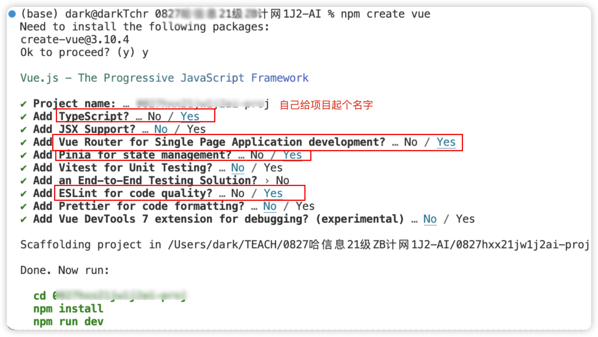
4. VSCode打开刚创建的【项目目录】

打开内置终端。检查光标左侧显示的位置，是不是你的项目路径【内置终端无法执行命令的，用系统终端代替】
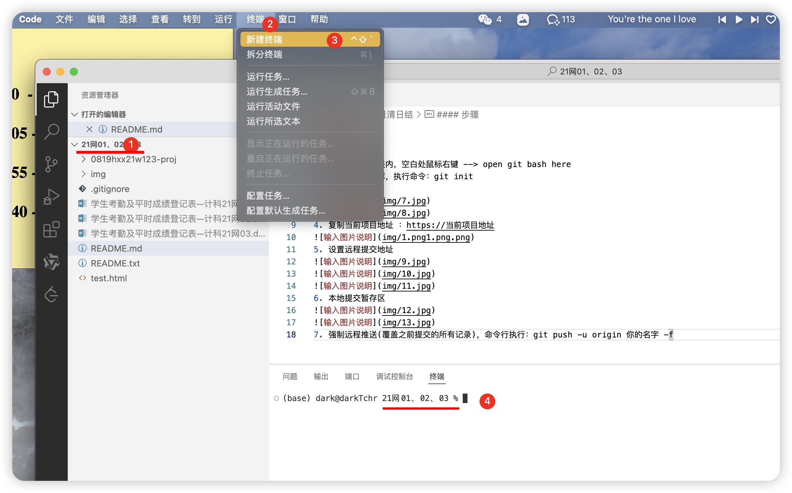
执行后两行代码
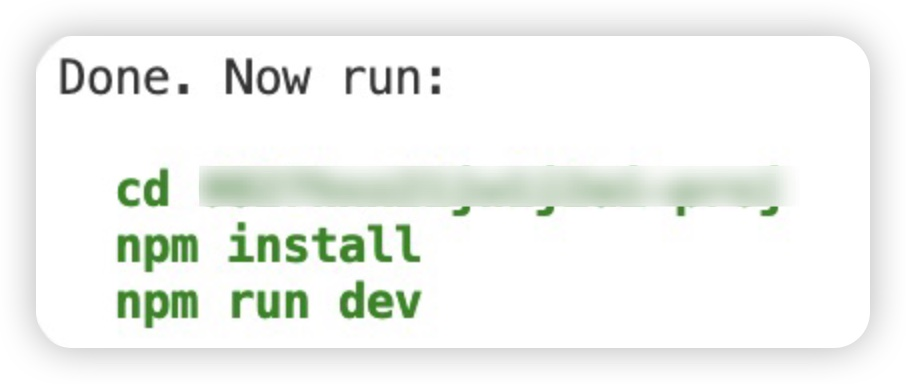
执行成功后,访问【地址】预览项目
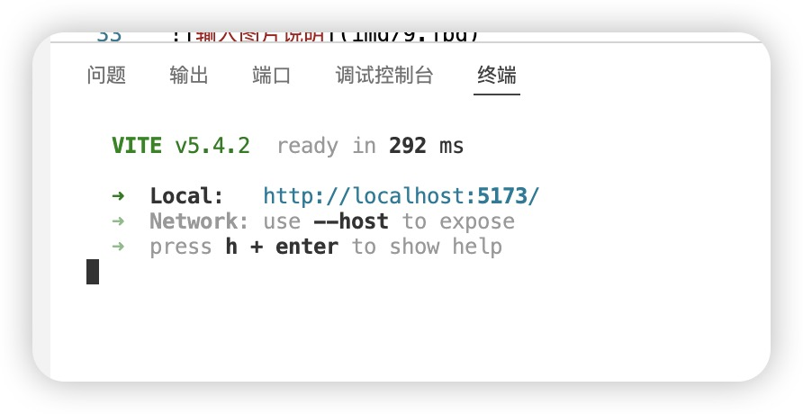

5. 初始化本地仓库，在项目根目录执行命令：git init 
或
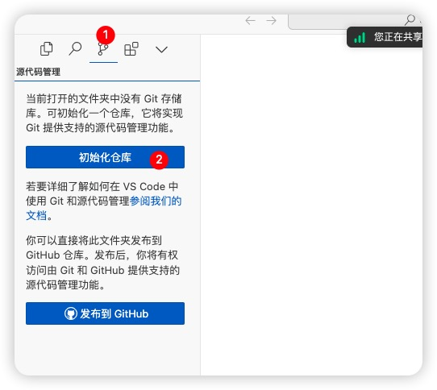
6. 本地提交暂存区，提交备注必须写，无法跳过
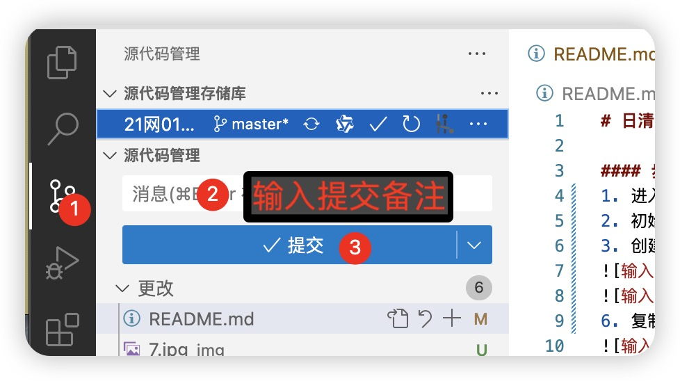 
7. 创建分支
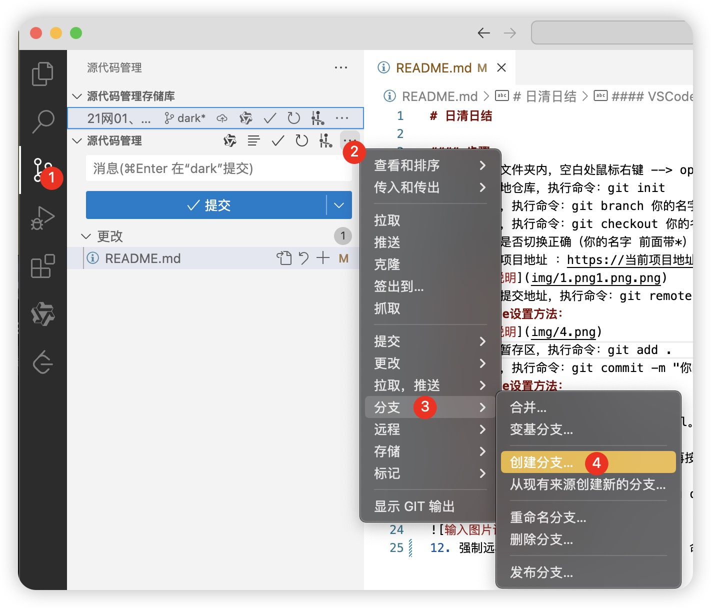

8. 当前仓库页【下载/克隆】窗口中，复制当前项目地址 ：https://当前项目地址
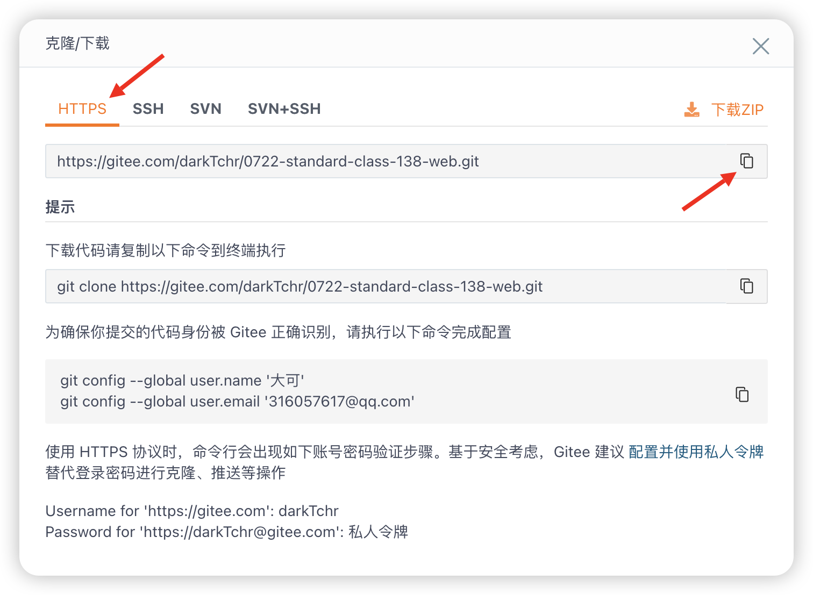
9. 设置远程提交地址
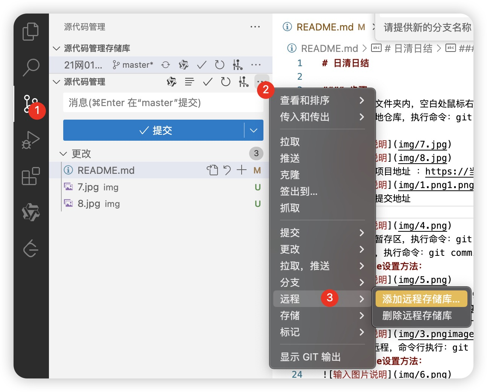
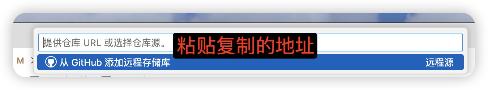
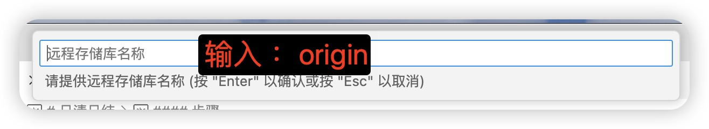
10. 本地提交&推送到云端
 
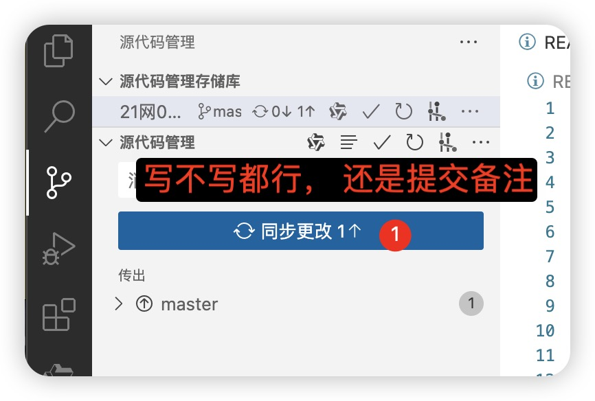 
如果按钮叫【发布...】，一样的，点就行
11. 【特殊情况】【先不用执行】强制远程推送(覆盖之前提交的所有记录)，命令行执行：git push -u origin 你的名字 -f